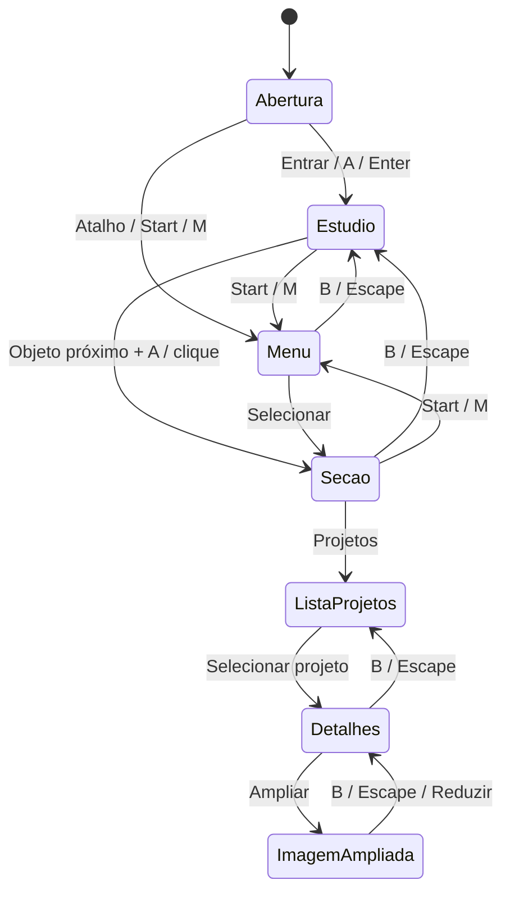

# Navegação do console

```mermaid
stateDiagram-v2
    [*] --> Abertura
    Abertura --> Estudio: Entrar / A / Enter
    Abertura --> Menu: Atalho / Start / M
    Estudio --> Menu: Start / M
    Estudio --> Secao: Objeto próximo + A / clique
    Menu --> Secao: Selecionar
    Menu --> Estudio: B / Escape
    Secao --> Estudio: B / Escape
    Secao --> Menu: Start / M
    Secao --> ListaProjetos: Projetos
    ListaProjetos --> Detalhes: Selecionar projeto
    Detalhes --> ListaProjetos: B / Escape
    Detalhes --> ImagemAmpliada: Ampliar
    ImagemAmpliada --> Detalhes: B / Escape / Reduzir
```
